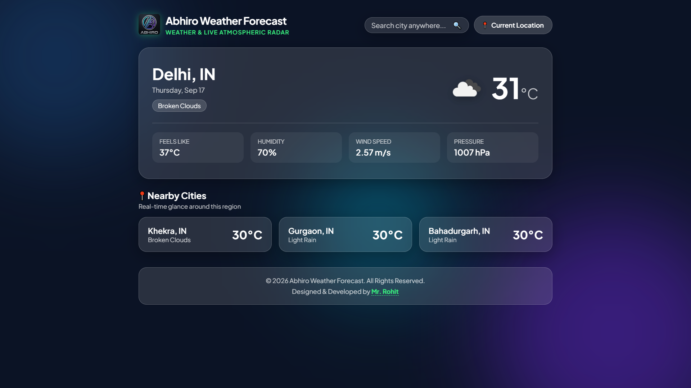

# ☁️ Abhiro Weather Forecast

A sleek, responsive Single Page Application (SPA) designed to deliver real-time meteorological metrics, localized atmospheric conditions, and dynamic regional neighborhood discovery.

---

## 🔗 Live Demo
👉 **[View Live Website](https://live-weather-abhiro.vercel.app/)** 

---


## 📸 Preview & Screenshots


---

## ✨ Key Features

* **Real-Time Weather Metrics:** Live temperature, "feels like" reading, humidity levels, wind velocity, and atmospheric pressure.
* **Automated Geolocation:** Instant GPS retrieval using the browser's `navigator.geolocation` API with error fallbacks.
* **Dynamic Neighboring Radar:** Automatically computes radial geographic coordinates around any searched city to query and display 3 real neighboring towns or suburbs.
* **Modern Glassmorphism Design:** Styled with CSS frosted glass surfaces, backdrop filters, fluid responsive layouts, and ambient glowing backgrounds.
* **Zero Dependencies:** Built entirely with vanilla HTML5, CSS3, and modern JavaScript (ES6+ Fetch API).

---

## 🛠️ Tech Stack

* **Markup:** HTML5 (Semantic elements)
* **Styling:** CSS3 (Flexbox, CSS Grid, Glassmorphism, Keyframe Animations)
* **Scripting:** Modern JavaScript (Async/Await, Fetch API, Geolocation API)
* **Weather Data Source:** [OpenWeatherMap API](https://openweathermap.org/)

---

## 🚀 Getting Started Locally

### 1. Clone the Repository
```bash
git clone [https://github.com/](https://github.com/)MrTechRohit/abhiro-weather.git
cd abhiro-weather
